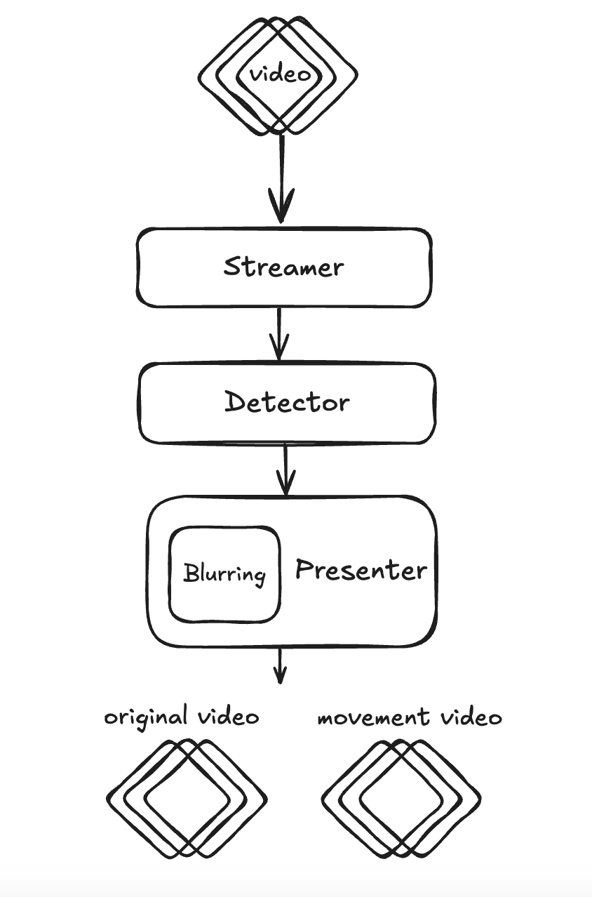

# Video Stream Analyzer

## Overview

This project is a real-time video processing pipeline that streams a video, detects motion in frames, and applies blurring to detected motion areas before displaying the processed frames. The system is built using Python with OpenCV and Scikit-Image.


## Features

- **Streamer**: Reads video frames from an MP4 file and sends them to a queue.
- **Detector**: Processes frames to detect motion using frame differencing.
- **Presenter**: Displays the processed video with motion blurring and timestamps.
- **Blurring**: Applies Gaussian blur to areas where motion is detected.
- **Multi-threading**: Uses threading to handle video processing in parallel.

## Installation

### Prerequisites

Ensure you have Python installed (I used 3.12 you may have problem with the requirements if you will use old version) and install the required dependencies:

```sh
pip install --upgrade pip
```
and then 
```sh
pip install -r requirements.txt
```

## Usage

1. Place your MP4 video file in the project directory.
2. Update the FILE_PATH for the video you want.
3. Run main.py script

```sh
python main.py
```

## File Structure

```
.
├── main.py                    # Main script
├── Detector.py                # Detector class
├── Presenter.py               # Presenter class
├── Streamer.py                # Streamer class
├── README.md                  # Documentation
├── requirements.txt           # Requirements file
└── video.mp4                  # Example video file
```

## How It Works

1. The **Streamer** reads frames from the video file and pushes them into a queue.
2. The **Detector** processes each frame, identifies motion, and marks the moving areas.
3. The **Presenter** applies Gaussian blur to motion areas, overlays a timestamp, and displays the frame.

## Controls

- Press `q` to exit the video display.

